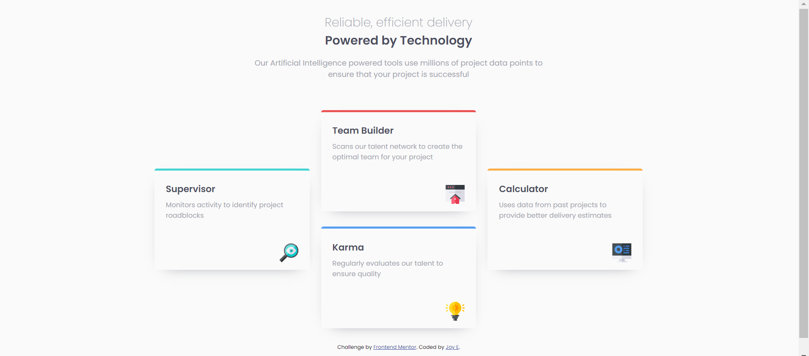

# Frontend Mentor - Four card feature section solution

This is a solution to the [Four card feature section challenge on Frontend Mentor](https://www.frontendmentor.io/challenges/four-card-feature-section-weK1eFYK). Frontend Mentor challenges help you improve your coding skills by building realistic projects. 

## Table of contents

- [Overview](#overview)
  - [The challenge](#the-challenge)
  - [Screenshot](#screenshot)
  - [Links](#links)
- [My process](#my-process)
  - [Built with](#built-with)
  - [What I learned](#what-i-learned)
  - [Continued development](#continued-development)

**Note: Delete this note and update the table of contents based on what sections you keep.**

## Overview

### The challenge

Users should be able to:

- View the optimal layout for the site depending on their device's screen size

### Screenshot

### Links

- Solution URL: 
- Live Site URL: 

## My process

### Built with

- Semantic HTML5 markup
- CSS custom properties
- CSS Grid
- Mobile-first workflow

### What I learned

My learning approach to CSS Grid was very haphazard compared to when I was learning Flexbox. I just looked at W3school and experimented and copied the code without getting into the nitty gritty understanding. I know this was a very poor way to learn CSS Grid especially since it is more difficult than CSS Flexbox. 

### Continued development

Obviously, going to become a serious candidate and revise over the CSS Grid model. Will also redo this project again with SASS since I've done some learning on it. I feel like I could have put more effort into this project!
